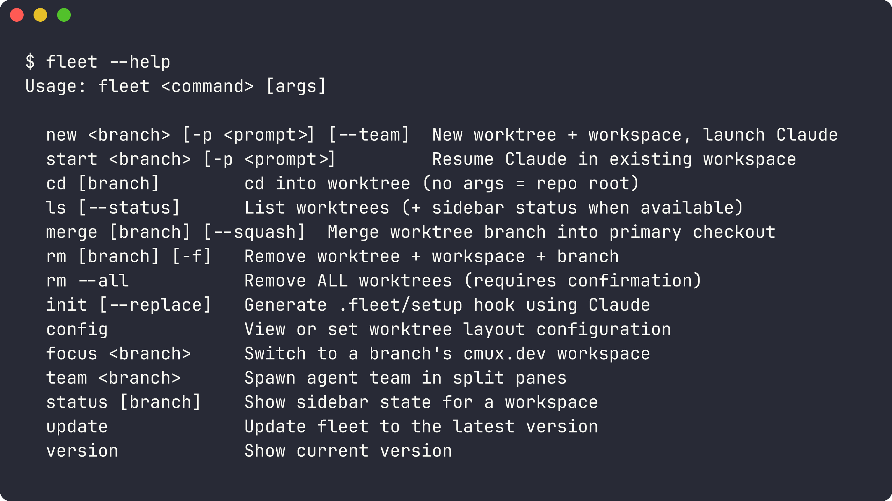
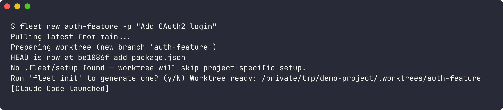
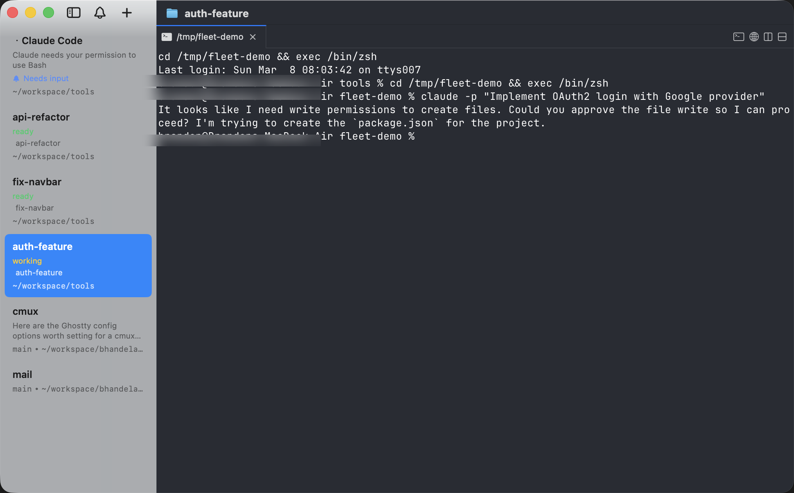
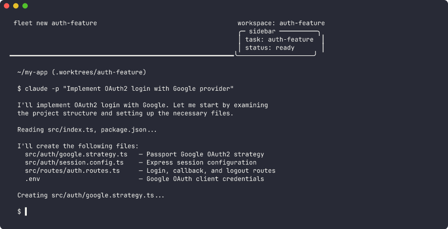
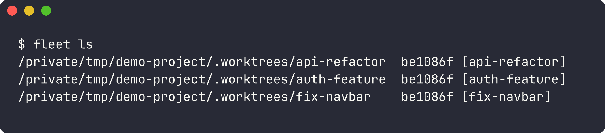
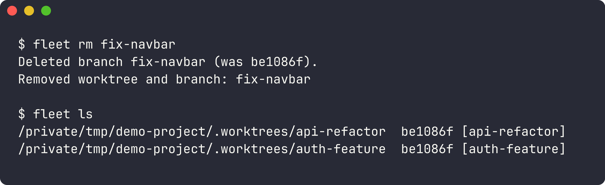
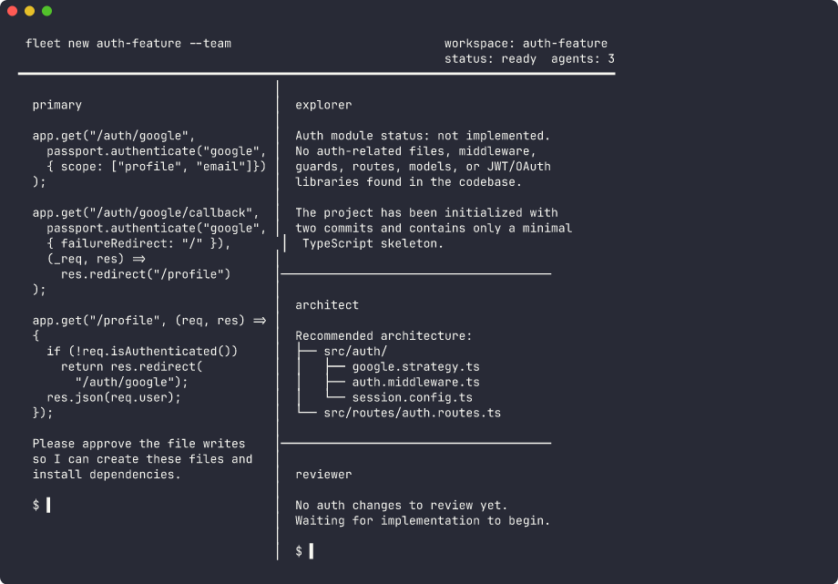

# fleet

> **This repo is mirrored from [GitLab](https://gitlab.com/nighthawk-oss/fleet).** Issues, merge requests, and contributions should go there.

Claude Worktree Manager with [cmux.dev](https://cmux.dev) integration.

Manages git worktree lifecycles for parallel Claude Code sessions. Each agent gets its own worktree — no conflicts, one command each. When cmux.dev is available, each worktree gets its own workspace with sidebar status and notifications.



## Install

```bash
curl -fsSL https://gitlab.com/nighthawk-oss/fleet/-/raw/main/install.sh | sh
```

## Quick start

```bash
cd your-repo
fleet new auth-feature -p "Add OAuth2 login"
```



Without cmux.dev, this cd's into the worktree and launches Claude inline. With cmux.dev, each branch gets its own workspace tab — launch several in parallel and switch between them:



Each workspace has sidebar status showing the branch name and current state:



## Managing worktrees

List active worktrees and clean up when done:





## Commands

```
fleet new <branch> [-p <prompt>] [--team]  — New worktree + workspace, launch Claude
fleet start <branch> [-p <prompt>]         — Resume Claude in existing workspace
fleet cd [branch]                          — cd into worktree (no args = repo root)
fleet ls [--status]                        — List worktrees (+ sidebar status)
fleet merge [branch] [--squash]            — Merge worktree branch into primary checkout
fleet rm [branch | --all] [-f]             — Remove worktree + workspace + branch
fleet init [--replace]                     — Generate .fleet/setup hook using Claude
fleet config [set <key> <value> [--global]] — View/set layout config
fleet focus <branch>                       — Switch to a branch's cmux.dev workspace
fleet team <branch>                        — Spawn agent team in split panes
fleet status [branch]                      — Show sidebar state for a workspace
fleet update / fleet version
```

## Agent teams

With cmux.dev, `--team` spawns explorer, architect, and reviewer agents in split panes:

```bash
fleet new big-refactor --team
```



## Setup hooks

Generate a project-specific setup hook that runs after worktree creation:

```bash
fleet init
```

This creates `.fleet/setup` — a bash script that symlinks secrets, installs deps, and runs codegen. Commit it to your repo.

## Layout modes

```bash
fleet config set layout nested          # .worktrees/<branch> (default)
fleet config set layout outer-nested    # ../<repo>.worktrees/<branch>
fleet config set layout sibling         # ../<repo>-<branch>
```
